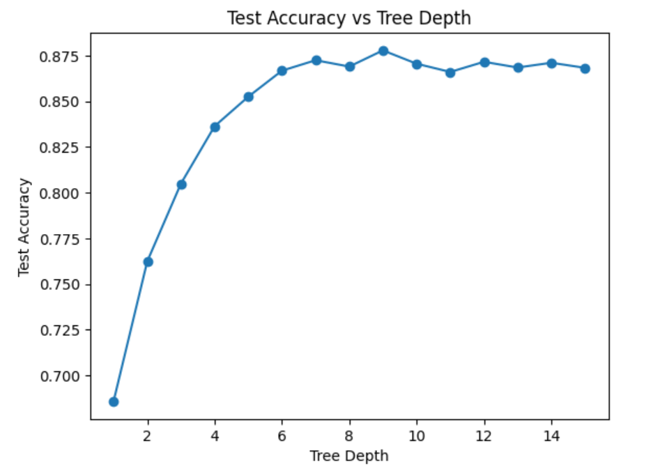

# Decision Tree Classifier Implementation (From Scratch)

## Overview

This project implements a Decision Tree Classifier from scratch in Python without using external libraries like scikit-learn for the core decision tree logic. The implemented model can perform classification on tabular datasets, and the project also includes a functionality to visualize the effect of tree depth on test accuracy.

## Files

- **decision_tree.py:** This is the main script that contains the DecisionTree class and related functions to grow, train, and evaluate the decision tree. It also includes a method to plot accuracy vs. tree depth.

## Key Features

### 1. Node Class: 
Defines each node of the tree, storing information like feature index, threshold, and pointers to left and right child nodes. If the node is a leaf, it stores the predicted class value.

### 2. DecisionTree Class:

- **fit(X, y):** Fits the decision tree on the input data X and labels y.
- **predict(X):** Predicts the class labels for the input data X.
- **_grow_tree(X, y, depth):** Recursively grows the decision tree by splitting the data until a stopping condition is met (maximum depth or minimum number of samples).
- **_best_split(X, y, feat_idxs):** Identifies the best feature and threshold to split the data based on information gain.
- **_information_gain(y, X_column, threshold):** Calculates the information gain for a given feature split.
- **plot_accuracy_vs_depth(X_train, y_train, X_test, y_test):** Plots the accuracy vs. tree depth, showing how the depth of the tree affects classification performance on the test set.

### 3. Custom Entropy Calculation: 
The entropy function computes the uncertainty in the data labels and is used to decide the best split points during tree construction.

### 4. Custom Accuracy Function:
A simple accuracy function is defined to measure the performance of the model on test data by comparing predictions with the ground truth labels.

### 5. Depth vs Accuracy Plot:
The implementation includes a feature to visualize the impact of tree depth on test accuracy, allowing for easy hyperparameter tuning.



## Dataset

The model uses a CSV dataset (Q1Data.csv), where the target column is Genus (encoded using LabelEncoder). The dataset is split into features X (first six columns) and target y. The train-test split is done with 80% of the data for testing and 20% for training.

## Usage

### 1. Install dependencies:

``` pip install numpy pandas scikit-learn matplotlib ```

### 2. Running the Model:

- Place the dataset Data.csv in the same directory.
- Run the script:

``` python3 decision_tree.py ```

### 3. Output

- The script will train the Decision Tree on the provided dataset, predict values for the test set, and print the accuracy.
- It will also plot the test accuracy as a function of tree depth, allowing you to visualize how deeper trees impact model performance.


